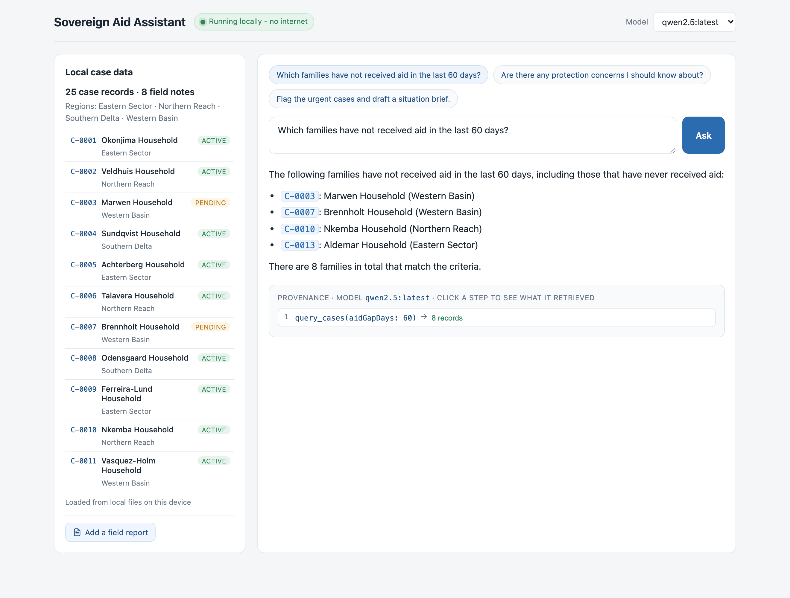
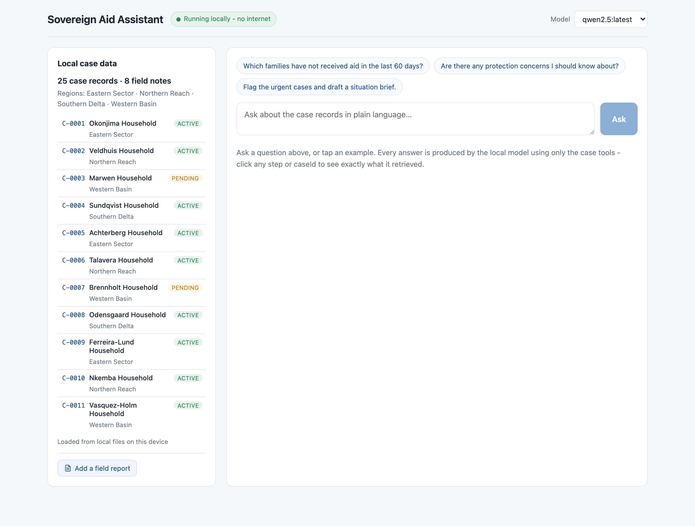
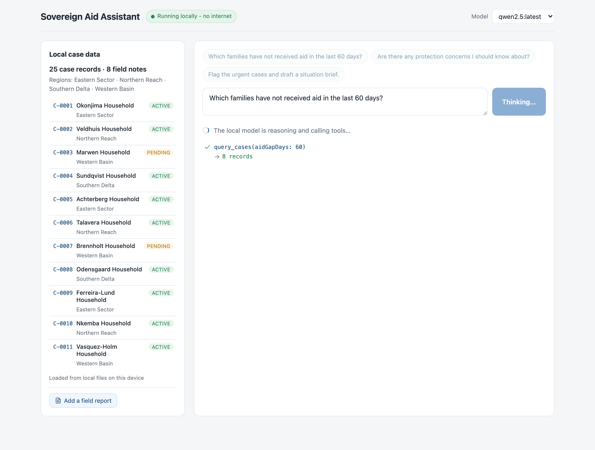
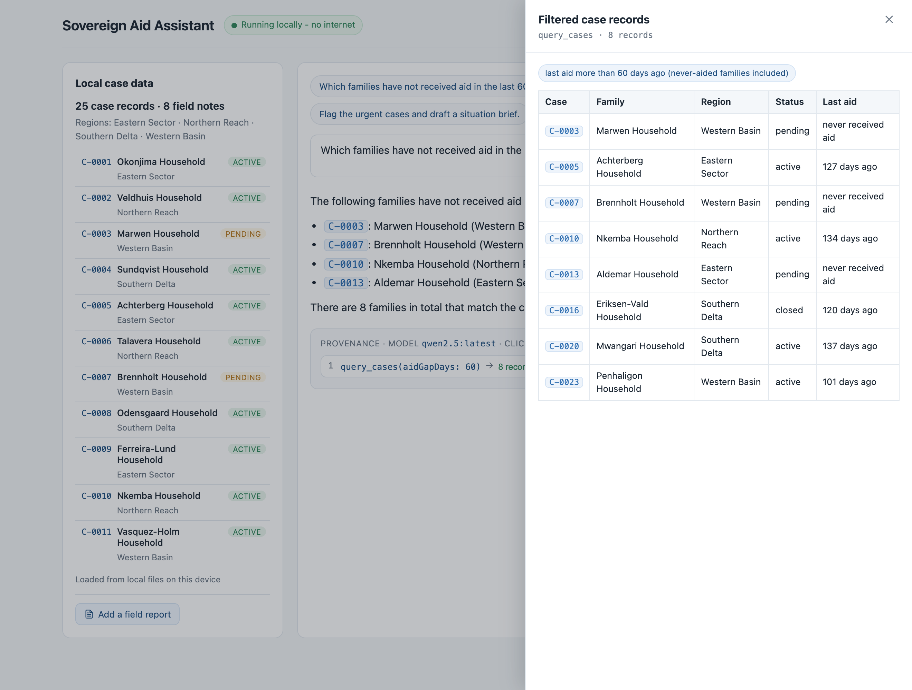
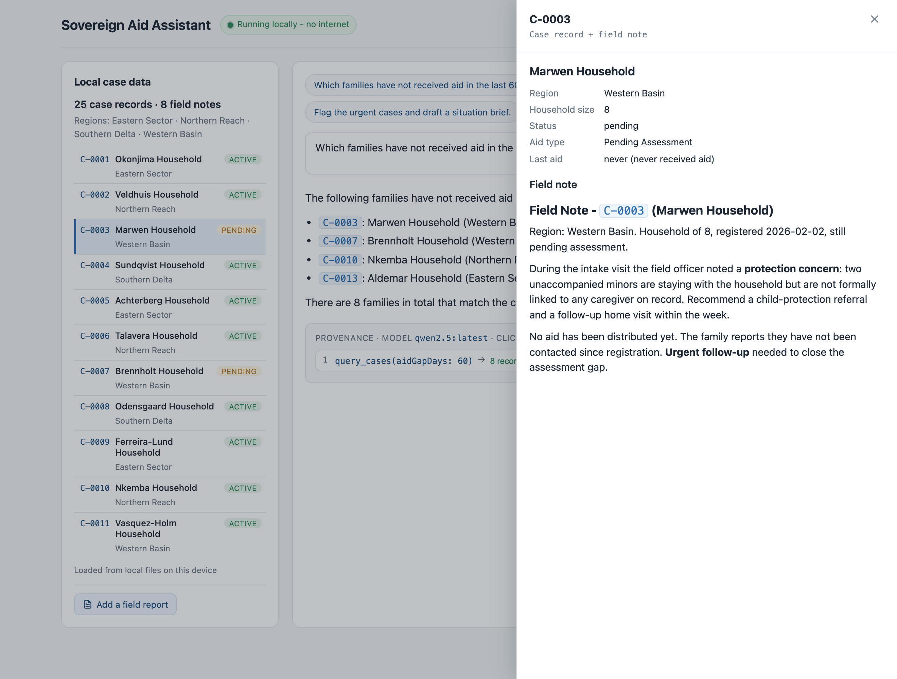
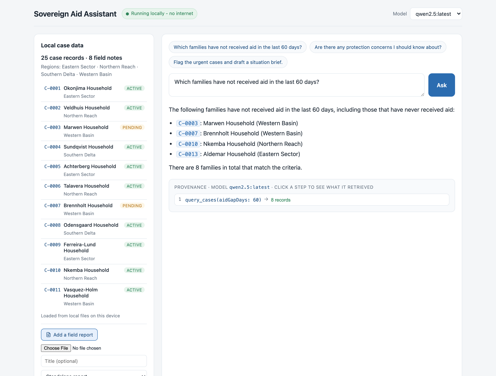

# Sovereign Aid Assistant

A **local-first, fully offline** AI assistant for an NGO's confidential case data.

A caseworker asks a question in plain language. A **local** language model (run by
[Ollama](https://ollama.com) on the same machine) answers it - but it can only get
facts by calling **MCP tools** that query and read **local** files. Nothing is ever
sent off the machine - not the case data, not the questions, not even the documents
you add. The user can switch the underlying model live from a dropdown and the app
keeps working, proving there is **no vendor lock-in**.

This is a reference implementation of *sovereign AI as digital public
infrastructure*: an open building block any agency or NGO can self-host.

> **All data in this repository is synthetic and fictional.** See
> [`data/DATA_IS_SYNTHETIC.md`](data/DATA_IS_SYNTHETIC.md).



---

## Why it matters

- **No data leaves the device.** After install, the app runs with networking
  disabled. There is no cloud model, no API key, no telemetry. Even documents you
  upload are parsed and stored on the machine.
- **The model never touches data directly.** Every fact comes through a Model
  Context Protocol (MCP) tool. The UI streams each tool call **live as it happens**,
  and afterwards every step is **clickable** - you can open exactly what was
  retrieved, and click any caseId in an answer to see its source record and note.
  Provenance is the product, not an afterthought.
- **Model-agnostic.** Swap `qwen2.5` for `gemma4` (or any installed model) mid-demo
  with a dropdown - no restart. The architecture doesn't change; only the model name
  sent to Ollama. Both produce the same correct answers.
- **Runs on one laptop.** Two models (~14 GB on disk), one loaded in RAM at a time,
  no datacenter and no cloud bill. Sovereign AI a resource-constrained agency can
  actually afford to self-host.

---

## Architecture

```
                ┌──────────────────────────────────────────────┐
  Browser  ──▶  │  Express backend (one process, port 8000)     │
  (React)       │                                                │
                │   /api/ask/stream ─▶ Agent loop ─▶ Ollama       │   localhost:11434
                │      (SSE)             │         (local model)   │   (no internet)
                │                        ▼                         │
                │            MCP client  ◀──stdio──▶  MCP server    │  ← the tool boundary
                │                                     (7 tools)     │
                └──────────────────────────────────────────────┘
                                                  │
                                                  ▼
                                       /data  (local JSON + notes)
```

The **MCP server is a separate process** spawned by the backend and spoken to over
stdio - exactly as any MCP host (e.g. an IDE) would. That keeps the boundary honest:
the only path from the model to local data is across a real MCP connection. The tool
implementations live in a clean, framework-neutral module
([`mcp-server/src/tools.ts`](mcp-server/src/tools.ts)) so they can also run standalone
(`npm run mcp`).

**HTTP endpoints** (all same-origin, no auth): `GET /api/models`, `GET /api/data`,
`GET /api/case/:id`, `POST /api/ask` and `POST /api/ask/stream` (Server-Sent Events
for live tool-call streaming), `POST /api/notes` (document upload), `GET /api/health`.

### The 7 tools

| Tool | Kind | What it does |
|------|------|--------------|
| `list_cases` | query | List all case records (id, family, region, status, last aid). |
| `query_cases` | query | Filter by region / status / aid type / **aidGapDays**. The date math (e.g. "no aid in 60 days") happens **in the tool**, not the model. |
| `list_notes` | read | List which cases have a field note. |
| `read_note` | read | Return one case's field note. |
| `search_notes` | read | Keyword search across all field notes. |
| `flag_case` | action | Mark a case as priority + record a reason (in memory). |
| `generate_brief` | action | Compile a Markdown situation brief from structured + narrative data and **write it to `data/briefs/`**. |

### Uploading documents

Caseworkers can add their own field reports from the left panel ("Add a field
report"). Text, Markdown, and PDF are accepted; PDFs are parsed to text locally
(via `pdf-parse`). The file is read in the browser, sent to a local endpoint
(`POST /api/notes`), and written to `data/notes/` - **nothing is sent off the
machine**. The agent can search and read the uploaded document immediately
(`search_notes` / `read_note`), with no restart. A report can be left standalone
or attached to an existing case. Standalone uploads are written as
`data/notes/DOC-*.md` and are git-ignored so demo uploads don't dirty the repo.
Ready-made sample reports to drag in live are in [`examples/`](examples/).

---

## The interface

One clean page, built so a non-technical audience can follow the agent's reasoning:

- **Header** - app name, a "Running locally" badge, and the model dropdown.
- **Left panel** - the local data, human-readable. Each case row is clickable
  (opens its record + field note); this is also where you upload documents.
- **Centre** - the question box with example chips, and the answer.
- **Live activity** - while the agent works, each tool call streams in as it
  happens (spinner → green check with its result), so the audience watches it
  search, flag, and write rather than staring at a spinner.
- **Provenance** - after the answer, every tool call is a clickable step that opens
  the retrieved data in a side panel, and every caseId citation links to its source.
- All UI is rendered **deterministically from the structured tool results** (not
  generated by the model), so it's reliable on stage and identical across models.
  Icons are inline SVG; no emoji, no icon-library fetch, nothing loaded at runtime.

### Screenshots

| | |
|---|---|
| **Overview** - local data + ask box | **Live tool calls** stream while it works |
|  |  |
| **Provenance panel** - what the tool retrieved | **Case detail** from a clicked caseId |
|  |  |
| **Upload a field report** (text / Markdown / PDF) | |
|  | |

---

## Prerequisites

- **Node.js ≥ 18.17** (Node 20 LTS recommended).
- **[Ollama](https://ollama.com/download)** installed and running locally.
- At least one **tool-calling-capable** model pulled (see below).

### Pull the models

```bash
# Recommended primary - reliable tool-calling, ~4.7 GB, fast on a laptop:
ollama pull qwen2.5

# Second model for the live model-swap (different vendor, ~9.6 GB):
ollama pull gemma4
```

**Tested models** (this app relies on Ollama's function-calling `tools` API):

| Model | Tool-calling | All 3 demo flows | Notes |
|-------|:---:|:---:|-------|
| `qwen2.5` (~4.7 GB) | ✅ | ✅ | Recommended primary; auto-selected as default. |
| `gemma4` (~9.6 GB) | ✅ | ✅ | Current Gemma; good model-swap partner. |
| `llama3.1` (~4.7 GB) | ✅ | ✅ | Also works (sends numeric args as strings; the tool coerces them). |
| `gemma3` / `gemma2` | ❌ | n/a | No `tools` template in Ollama (`"does not support tools"`). |

The app lists whatever you have installed and auto-selects the most reliable one.
If you pick a model that can't emit tool calls (e.g. `gemma3`), it shows a clear
message telling you to choose a tool-capable model - it never fails silently or
crashes. On a 32 GB laptop, run one large model at a time (see Hardware footprint).

---

## Run it

```bash
npm install      # one-time, needs network
npm run setup    # installs + builds the frontend (alias for install + build:web)
npm run dev      # builds the frontend and starts everything on http://localhost:8000
```

Open **http://localhost:8000**.

`npm run dev` builds the React app, starts the Express backend, connects to the MCP
tool server, and warms **the default model** in the background so the first on-stage
question is fast. (It warms only one - loading every installed model at once would
exhaust RAM on a laptop.)

### Other commands

| Command | What it does |
|---------|--------------|
| `npm run warmup` | Pre-load the default model (or `npm run warmup -- gemma4:latest` for a specific one). |
| `npm run build:web` | Build the frontend only. |
| `npm run mcp` | Run the MCP tool server standalone (stdio) for inspection. |
| `npm run web:dev` | Vite dev server with hot-reload (proxies `/api` to :8000). |

### Configuration (env vars)

| Variable | Default | Purpose |
|----------|---------|---------|
| `PORT` | `8000` | Backend / web port. |
| `DEMO_TODAY` | `2026-06-01` | The operational "today" for aid-gap math. Fixed so the demo is deterministic. |
| `OLLAMA_HOST` | `http://localhost:11434` | Local model runtime. |
| `DATA_DIR` | `./data` | Where case data lives. |

---

## Running fully offline (the whole point)

After `npm install` and `ollama pull`, **disconnect from the internet** and run
`npm run dev`. Everything works:

- The frontend is bundled locally by Vite - there are **no `<script src="https://…">`
  tags and no CDN references**.
- The backend talks only to `localhost:11434` (Ollama) and the local MCP process.
- All case data is read from local files.

### How to verify there is no network egress

1. **Inspect the built frontend** - no external URLs are fetched:
   ```bash
   npm run build:web
   grep -rE "https?://" web/dist/   # only matches a React error-string, never a fetch/CDN
   ```
2. **Watch the network while you use it.** With the app running, open your browser's
   DevTools → Network tab and ask all three demo questions. Every request is
   same-origin (`localhost:8000`); the backend's only outbound calls are to
   `localhost:11434`.
3. **Pull the plug.** Turn off Wi-Fi / unplug Ethernet and run the full demo. It
   behaves identically. (macOS: you can also confirm with Little Snitch / `lsof -i`
   that the only listeners/connections are localhost.)

---

## The 8-minute demo

Use the clickable example chips, or type the questions.

1. **Structured / compute -** *"Which families have not received aid in the last 60 days?"*
   The agent calls `query_cases(aidGapDays: 60)` and lists the **8** families. (The
   date arithmetic is done in the tool, against `DEMO_TODAY`.)

2. **Narrative / read -** *"Are there any protection concerns I should know about?"*
   The agent calls `search_notes("protection")`, finds **3** notes (cases C-0003,
   C-0007, C-0013), summarises them, and cites the caseIds.

3. **Action / multi-step -** *"Flag the urgent cases and draft a situation brief."*
   The agent finds the urgent cases, calls `flag_case` on them, then
   `generate_brief(...)` - which **writes a real Markdown file** to `data/briefs/`.
   The brief appears as a card you can open and read, rendered cleanly.

4. **Upload a document.** In the left panel, "Add a field report" → drag in
   [`examples/field-report-bridge-collapse.md`](examples/field-report-bridge-collapse.md)
   (or the `.pdf`). Re-ask question #2 - the agent now surfaces the just-uploaded
   report alongside the existing cases, proving it's searchable and never left the
   machine.

**Then: switch the model.** Use the dropdown to pick `gemma4` and re-run question #1.
Both models produce the same correct answer - the architecture is model-agnostic.
While each answer streams, you watch the tool calls happen; afterwards, click any
step or caseId to see exactly what was retrieved.

---

## Hardware footprint

Part of the sovereignty story: this runs on hardware a field office already owns.

- **Disk:** the two recommended models total **~14 GB** (`qwen2.5` 4.7 GB + `gemma4`
  9.6 GB). The app code and data are a few MB.
- **RAM:** Ollama loads a model only when used and unloads it after a few idle
  minutes. The app warms just one model at startup. On a **32 GB** laptop, keep one
  large model resident at a time - swapping models on stage briefly loads the second,
  so a lighter pair (e.g. `qwen2.5` + `gemma4`) keeps the swap smooth.
- **Cost:** $0 in cloud fees, and it keeps working with the network cable pulled.
- To free memory between sessions, quit the Ollama app (or `ollama stop <model>`);
  Ollama is a background daemon and holds model memory even when this app is closed.

---

## Project structure

```
sovereign-aid-assistant/
  data/
    cases.json            # 25 synthetic case records
    notes/*.md            # 8 synthetic field notes (+ uploaded DOC-*.md at runtime)
    briefs/               # generate_brief writes here at runtime
    DATA_IS_SYNTHETIC.md
  examples/               # sample reports to drag into the uploader (md / txt / pdf)
  mcp-server/             # MCP server + the 7 tools (framework-neutral tool layer)
    src/tools.ts          #   ← the data/action boundary
    src/index.ts          #   ← MCP server (stdio)
  server/                 # Express backend
    src/index.ts          #   ← API + static frontend, one port; ask/stream + upload
    src/mcpClient.ts      #   ← connects to the MCP server as a client
    src/ollama.ts         #   ← local model runtime (localhost:11434)
    src/agent.ts          #   ← the agentic loop, system prompt, streamed events
    src/warmup.ts         #   ← warms the default model
  web/                    # React + Vite frontend (one clean page)
    src/App.tsx           #   ← layout, model swap, live streaming, panel state
    src/Answer.tsx        #   ← answer + clickable provenance steps + brief card
    src/SidePanel.tsx     #   ← retrieved-data / case-detail slide-in panel
    src/Markdown.tsx      #   ← dependency-free Markdown + clickable caseIds
    src/Upload.tsx        #   ← document upload (text / Markdown / PDF)
    src/icons.tsx         #   ← inline SVG icons (no emoji, nothing fetched)
  README.md
  package.json            # one root package; runs via tsx, frontend via Vite
```

---

## What this intentionally does **not** include

Authentication, multi-user, a database, persistence beyond in-memory state + the
brief files + uploaded reports on disk, any cloud model, any API key, telemetry, or
a vector DB. Keyword + structured queries are sufficient and more legible for this
demo. Embeddings / semantic search are a natural extension but are deliberately out
of scope.

---

## License

[MIT](LICENSE). Published as an open reference implementation. Adapt it for your own
agency or NGO.
